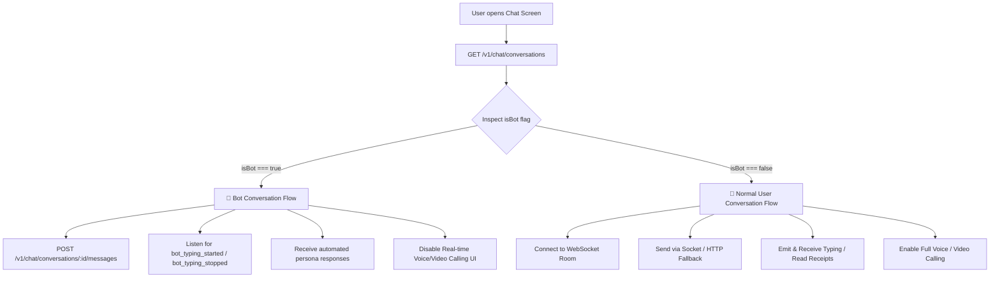

# Frontend Conversation Flow API Documentation

This document provides the complete API specification and decision flow for frontend engineers building the mobile and web chat experiences in the AI Marriage platform.

---

## 1. System Overview & Decision Flow

When a user opens the chat tab or navigates into a conversation, the frontend routes interactions based on the **`isBot`** flag returned by the Conversation Listing API:



### UX Directive (Zero Bot Badging)
> **IMPORTANT FOR FRONTEND**: Even when `isBot: true`, the UI **must never** show "AI", "Bot", or "Simulated" badges or disclaimers to the end-user. Both bot and human profiles share the identical UI styling, layout, and appearance.

---

## 2. Decision Routing Rule

| Returned `isBot` Value | Routing Target | Features Enabled / Handling |
| :--- | :--- | :--- |
| **`isBot: true`** | **Bot Conversation API** | AI Persona responses, natural typing simulation (`bot_typing_started`/`bot_typing_stopped`), realistic pacing delay, media uploads supported, voice/video calls disabled with graceful deflection. |
| **`isBot: false`** | **Normal User Conversation API** | Peer-to-peer human chat, WebSocket bi-directional messaging, live user typing, double-tick read receipts, message edit/delete, live WebRTC audio/video calling. |

---

## 3. Base Configuration & Authentication

- **Base URL**: `https://kkl6cd17-8000.inc1.devtunnels.ms` *(Staging / Tunnel)*
- **WebSocket URL**: `wss://kkl6cd17-8000.inc1.devtunnels.ms`
- **Authentication**: JWT Bearer Token in `Authorization` header for all HTTP calls and `auth.token` during Socket handshake.

```http
Authorization: Bearer <JWT_ACCESS_TOKEN>
Content-Type: application/json
```

---

## 4. API 1: Conversation Discovery / Listing API

Retrieves all active mutual matches and conversations for the authenticated user, indicating whether each counterpart is a bot or a real user.

- **Endpoint**: `/v1/chat/conversations` *(Alias: `/v1/conversations`)*
- **HTTP Method**: `GET`
- **Authentication**: Required (`Bearer <token>`)

### Request Parameters
*None (Headers only).*

### Response Schema
```typescript
interface GetConversationsResponse {
  success: boolean;
  data: Array<{
    id: string;                    // Conversation CUID
    isBot: boolean;                // Root isBot indicator (true = Bot, false = Human)
    recipient: {
      id: string;                  // Counterpart User ID
      name: string;                // Counterpart Name
      avatarUrl: string | null;    // Presigned CDN / S3 avatar image URL
      isBot: boolean;              // Recipient isBot indicator
    };
    lastMessage: {
      id: string;                  // Message CUID
      content: string;             // Message text preview
      type: MessageType;           // 'TEXT' | 'IMAGE' | 'AUDIO' | 'VIDEO' | 'DOCUMENT' | 'CALL' | 'SYSTEM'
      senderId: string;            // User ID who sent the last message
      readAt: string | null;       // ISO 8601 timestamp when read, or null if unread
      isEdited: boolean;           // True if message was edited
      isDeleted: boolean;          // True if message was deleted
      createdAt: string;           // ISO 8601 creation timestamp
    } | null;
    unreadCount: number;           // Count of unread messages sent by counterpart
    createdAt: string;             // ISO 8601 timestamp
    updatedAt: string;             // ISO 8601 timestamp of last interaction
  }>;
}
```

### Response Payload Example (`200 OK`)
```json
{
  "success": true,
  "data": [
    {
      "id": "cm1convo00001234567890ab",
      "isBot": true,
      "recipient": {
        "id": "cm1bot00001234567890cd",
        "name": "Priya Sharma",
        "avatarUrl": "https://storage.aimarriage.com/avatars/priya.jpg",
        "isBot": true
      },
      "lastMessage": {
        "id": "cm1msg00001234567890ef",
        "content": "Hey! How was your day?",
        "type": "TEXT",
        "senderId": "cm1bot00001234567890cd",
        "readAt": null,
        "isEdited": false,
        "isDeleted": false,
        "createdAt": "2026-10-08T07:15:00.000Z"
      },
      "unreadCount": 1,
      "createdAt": "2026-10-08T07:00:00.000Z",
      "updatedAt": "2026-10-08T07:15:00.000Z"
    },
    {
      "id": "cm1convo00001234567890xy",
      "isBot": false,
      "recipient": {
        "id": "cm1human00001234567890zz",
        "name": "Rohan Mehta",
        "avatarUrl": "https://storage.aimarriage.com/avatars/rohan.jpg",
        "isBot": false
      },
      "lastMessage": {
        "id": "cm1msg00001234567890gh",
        "content": "Looking forward to connecting!",
        "type": "TEXT",
        "senderId": "cm1human00001234567890zz",
        "readAt": "2026-10-08T06:50:00.000Z",
        "isEdited": false,
        "isDeleted": false,
        "createdAt": "2026-10-08T06:45:00.000Z"
      },
      "unreadCount": 0,
      "createdAt": "2026-10-08T06:00:00.000Z",
      "updatedAt": "2026-10-08T06:50:00.000Z"
    }
  ]
}
```

---

## 5. API 2: Bot Conversation API (`isBot: true`)

Used when interacting with automated persona accounts. The backend orchestrates AI model turns with realistic human pacing delays and emits natural typing states.

### 5.1 Send Message to Bot
Sends a message to the bot account.

- **Endpoint**: `/v1/chat/conversations/:conversationId/messages`
- **HTTP Method**: `POST`
- **Authentication**: Required (`Bearer <token>`)

#### Request Schema
```typescript
interface SendMessagePayload {
  conversationId: string;         // Required: CUID of active conversation
  content: string;                // Required for TEXT: 1-2000 characters
  type?: MessageType;             // Optional: 'TEXT' | 'IMAGE' | 'AUDIO' | 'VIDEO' | 'DOCUMENT' (Default: 'TEXT')
  mediaUrl?: string;              // Optional: S3 object key or URL (Required if type != TEXT)
  mediaThumbnail?: string;        // Optional: Thumbnail URL for video/image
  fileName?: string;              // Optional: Name of uploaded file (max 255 chars)
  fileSize?: number;              // Optional: Bytes (max 52,428,800 / 50MB)
  mimeType?: string;              // Optional: MIME type (max 100 chars)
}
```

#### Request Payload Example
```json
{
  "conversationId": "cm1convo00001234567890ab",
  "content": "Do you prefer cozy coffee shops or exploring the city on weekends?",
  "type": "TEXT"
}
```

#### Response Payload Example (`201 Created`)
```json
{
  "success": true,
  "data": {
    "message": {
      "id": "cm1msg9900112233445566aa",
      "conversationId": "cm1convo00001234567890ab",
      "senderId": "cm1human00001234567890zz",
      "content": "Do you prefer cozy coffee shops or exploring the city on weekends?",
      "type": "TEXT",
      "mediaUrl": null,
      "mediaThumbnail": null,
      "fileName": null,
      "fileSize": null,
      "mimeType": null,
      "isEdited": false,
      "editedAt": null,
      "isDeleted": false,
      "readAt": null,
      "createdAt": "2026-10-08T07:20:00.000Z"
    },
    "recipientId": "cm1bot00001234567890cd"
  }
}
```

---

### 5.2 Fetch Bot Conversation Messages (History)
Retrieves paginated message history between the user and the bot.

- **Endpoint**: `/v1/chat/conversations/:conversationId/messages`
- **HTTP Method**: `GET`
- **Query Parameters**:
  - `limit` *(optional, integer, default: 50, max: 100)*: Number of messages to retrieve.
  - `cursor` *(optional, string)*: Last message CUID for pagination.

#### Response Payload Example (`200 OK`)
```json
{
  "success": true,
  "data": {
    "messages": [
      {
        "id": "cm1msg00001234567890ef",
        "conversationId": "cm1convo00001234567890ab",
        "senderId": "cm1bot00001234567890cd",
        "content": "Hey! How was your day?",
        "type": "TEXT",
        "mediaUrl": null,
        "mediaThumbnail": null,
        "fileName": null,
        "fileSize": null,
        "mimeType": null,
        "isEdited": false,
        "editedAt": null,
        "isDeleted": false,
        "readAt": "2026-10-08T07:18:00.000Z",
        "createdAt": "2026-10-08T07:15:00.000Z"
      },
      {
        "id": "cm1msg9900112233445566aa",
        "conversationId": "cm1convo00001234567890ab",
        "senderId": "cm1human00001234567890zz",
        "content": "Do you prefer cozy coffee shops or exploring the city on weekends?",
        "type": "TEXT",
        "mediaUrl": null,
        "mediaThumbnail": null,
        "fileName": null,
        "fileSize": null,
        "mimeType": null,
        "isEdited": false,
        "editedAt": null,
        "isDeleted": false,
        "readAt": null,
        "createdAt": "2026-10-08T07:20:00.000Z"
      }
    ],
    "nextCursor": "cm1msg9900112233445566aa"
  }
}
```

---

### 5.3 Mark Bot Messages as Read
Notifies the backend that the user has seen incoming messages.

- **Endpoint**: `/v1/chat/conversations/:conversationId/read`
- **HTTP Method**: `POST`
- **Request Payload**:
```json
{
  "messageIds": ["cm1msg00001234567890ef"]
}
```

- **Response Payload (`200 OK`)**:
```json
{
  "success": true,
  "data": {
    "count": 1
  }
}
```

---

### 5.4 Real-Time Socket Events for Bot Conversations

The frontend connects to Socket.IO and listens for bot typing and incoming replies:

| Event Name | Direction | Payload | Description |
| :--- | :--- | :--- | :--- |
| `join_room` | Client ➔ Server | `{ "conversationId": "cm1convo..." }` | Joins the conversation room. |
| `bot_typing_started` | Server ➔ Client | `{ "conversationId": "cm1convo..." }` | Shows the animated 3-dot typing indicator in UI. |
| `bot_typing_stopped` | Server ➔ Client | `{ "conversationId": "cm1convo..." }` | Hides the typing indicator. |
| `message_received` | Server ➔ Client | Full message object (see Schema) | Appends the bot's generated response to the chat feed. |

---

## 6. API 3: Normal User Conversation API (`isBot: false`)

Used when interacting with real human users. Includes peer-to-peer WebSocket messaging, live read receipts, and live audio/video calling.

### 6.1 Send Message (HTTP Fallback / REST)

- **Endpoint**: `/v1/chat/conversations/:conversationId/messages`
- **HTTP Method**: `POST`
- **Payload & Response**: Identical to [Section 5.1](#51-send-message-to-bot).

---

### 6.2 Presigned Upload URL for Media Messages (Photo / Audio / Document)
Requests a secure Amazon S3 presigned PUT URL to upload media before sending.

- **Endpoint**: `/v1/chat/:conversationId/media/presigned-url`
- **HTTP Method**: `POST`

#### Request Payload
```json
{
  "conversationId": "cm1convo00001234567890xy",
  "fileName": "vacation_photo.jpg",
  "mimeType": "image/jpeg",
  "fileSize": 2048500,
  "type": "IMAGE"
}
```

#### Response Payload (`200 OK`)
```json
{
  "success": true,
  "data": {
    "uploadUrl": "https://s3.ap-south-1.amazonaws.com/aimarriage-media/chat/cm1convo.../photo.jpg?AWSAccessKeyId=...",
    "objectKey": "chat/cm1convo00001234567890xy/1728372000_photo.jpg",
    "expiresIn": 3600
  }
}
```

> **Client Upload Step**: Perform an HTTP `PUT` request with binary file data to `uploadUrl`, then pass `mediaUrl: objectKey` in `POST /v1/chat/conversations/:conversationId/messages`.

---

### 6.3 HTTP Message Edit & Delete Endpoints (REST Fallback)

#### Edit Message
- **Endpoint**: `/v1/chat/conversations/:conversationId/messages/:messageId`
- **HTTP Method**: `PATCH`
- **Request Payload**:
```json
{
  "content": "Hey Rohan! Updated message text here."
}
```
- **Response Payload (`200 OK`)**:
```json
{
  "success": true,
  "data": {
    "id": "cm1msg00001234567890gh",
    "conversationId": "cm1convo00001234567890xy",
    "content": "Hey Rohan! Updated message text here.",
    "isEdited": true,
    "editedAt": "2026-10-08T07:30:00.000Z"
  }
}
```

#### Delete Message
- **Endpoint**: `/v1/chat/conversations/:conversationId/messages/:messageId`
- **HTTP Method**: `DELETE`
- **Request Payload**:
```json
{
  "mode": "for_everyone"
}
```
*(Modes supported: `"for_everyone"` or `"for_me"`)*
- **Response Payload (`200 OK`)**:
```json
{
  "success": true,
  "data": {
    "success": true
  }
}
```

---

### 6.4 Real-Time WebSocket Protocol (`Socket.IO`)

Connect to: `wss://kkl6cd17-8000.inc1.devtunnels.ms` with auth handshake:

```javascript
const socket = io('https://kkl6cd17-8000.inc1.devtunnels.ms', {
  auth: {
    token: `Bearer ${userJwtToken}`
  },
  transports: ['websocket']
});
```

#### Event Reference

```typescript
// 1. Join Conversation Room
socket.emit('join_room', { conversationId: 'cm1convo00001234567890xy' });

// 2. Send Real-Time Message
socket.emit('send_message', {
  conversationId: 'cm1convo00001234567890xy',
  content: 'Hey Rohan! Great to connect.',
  type: 'TEXT'
});

// 3. Receive Incoming Message
socket.on('message_received', (message) => {
  console.log('New message:', message);
});

// 4. Edit Existing Message
socket.emit('edit_message', {
  conversationId: 'cm1convo00001234567890xy',
  messageId: 'cm1msg00001234567890gh',
  content: 'Updated message content'
});
socket.on('message_edited', (data) => {
  // Update message in state
});

// 5. Delete Message
socket.emit('delete_message', {
  conversationId: 'cm1convo00001234567890xy',
  messageId: 'cm1msg00001234567890gh',
  mode: 'for_everyone' // or 'for_me'
});
socket.on('message_deleted', (data) => {
  // Remove or mask message in state
});
```

---

### 6.5 Audio & Video Calling Protocol (`isBot: false` ONLY)

Live calling is enabled exclusively for human-to-human conversations:

```typescript
// Start Call
socket.emit('call:ring', {
  targetUserId: 'cm1human00001234567890zz',
  kind: 'AUDIO' // or 'VIDEO'
});

// Listen for Outgoing Call Room Token
socket.on('call:token', ({ callId, token, roomUrl }) => {
  // Initialize LiveKit / WebRTC room
});

// Incoming Call on Callee Device
socket.on('call:incoming', ({ callId, callerName, callerAvatar, kind }) => {
  // Display incoming call screen
});

// Accept Call
socket.emit('call:accept', { callId });

// Decline Call
socket.emit('call:reject', { callId });

// End Active Call
socket.emit('call:end', { callId });
```

---

### 6.6 User Setting: Toggle Practice Bot Interactions

Users can enable or disable being matched with automated conversation practice profiles.

- **Endpoint**: `/v1/me`
- **HTTP Method**: `PATCH`
- **Request Payload**:
```json
{
  "settings": {
    "practiceInteractions": true
  }
}
```
- **Response Payload (`200 OK`)**:
```json
{
  "success": true,
  "data": {
    "id": "cm1human00001234567890zz",
    "memberExperience": {
      "settings": {
        "practiceInteractions": true
      }
    }
  }
}
```

---

## 7. Field Definitions & Data Dictionary

| Field Name | Type | Required | Description |
| :--- | :--- | :--- | :--- |
| `id` | `string` (CUID) | Yes | Unique identifier for conversation or message. |
| `isBot` | `boolean` | Yes | `true` if counterpart is an AI persona; `false` if counterpart is a real human. |
| `recipient` | `object` | Yes | Counterpart profile information. |
| `recipient.name` | `string` | Yes | Display name of counterpart. |
| `recipient.avatarUrl` | `string \| null` | Yes | Download URL for recipient's avatar image. |
| `recipient.isBot` | `boolean` | Yes | Redundant mirror of `isBot` flag on the recipient level. |
| `lastMessage` | `object \| null` | Yes | Most recent message in thread or `null` if fresh match. |
| `content` | `string` | Yes* | Text content (max 2000 chars; required for `TEXT` type). |
| `type` | `MessageType` | No | Message category enum (default: `TEXT`). |
| `mediaUrl` | `string \| null` | No | S3 key or resolved URL for media content. |
| `unreadCount` | `number` | Yes | Count of unread messages pending user review. |
| `readAt` | `string \| null` | No | ISO timestamp when counterpart opened the message. |

---

## 8. Enums Reference

### MessageType Enum
```typescript
export enum MessageType {
  TEXT = 'TEXT',
  IMAGE = 'IMAGE',
  AUDIO = 'AUDIO',
  VIDEO = 'VIDEO',
  DOCUMENT = 'DOCUMENT',
  CALL = 'CALL',
  SYSTEM = 'SYSTEM'
}
```

### DeleteMode Enum
```typescript
export enum DeleteMode {
  FOR_EVERYONE = 'for_everyone',
  FOR_ME = 'for_me'
}
```

### CallKind Enum
```typescript
export enum CallKind {
  AUDIO = 'AUDIO',
  VIDEO = 'VIDEO'
}
```

---

## 9. Error Codes & HTTP Status Reference

| Status Code | Error Code | Error Message | Action Required / User Recovery |
| :--- | :--- | :--- | :--- |
| `400 Bad Request` | `VALIDATION_ERROR` | `"Text content is required for text messages"` | Ensure message string is non-empty before sending. |
| `401 Unauthorized` | `UNAUTHORIZED` | `"Authentication token required"` | Refresh JWT access token or redirect user to login. |
| `403 Forbidden` | `FORBIDDEN` | `"You are not a participant in this conversation"` | User does not have access to this conversation thread. |
| `403 Forbidden` | `DOUBLE_CONSENT_REQUIRED` | `"Double-consent is not active or has been revoked"` | Both users must have active mutual consent. |
| `403 Forbidden` | `USER_BLOCKED` | `"This conversation is unavailable due to an active user block"` | Disable message input; display block notice. |
| `404 Not Found` | `NOT_FOUND` | `"Conversation not found"` | Conversation ID does not exist in database. |
| `429 Too Many Requests`| `RATE_LIMITED` | `"Too many requests, please slow down"` | Implement exponential backoff retry. |
| `500 Server Error` | `INTERNAL_ERROR` | `"An unexpected error occurred"` | Display generic retry banner. |

---

## 10. Frontend Implementation Example (React Native / TypeScript)

```typescript
import React, { useEffect, useState } from 'react';
import { View, Text, FlatList, TouchableOpacity, Image } from 'react-native';

export interface ConversationItem {
  id: string;
  isBot: boolean;
  recipient: {
    id: string;
    name: string;
    avatarUrl: string | null;
    isBot: boolean;
  };
  lastMessage: {
    id: string;
    content: string;
    createdAt: string;
  } | null;
  unreadCount: number;
}

export const ConversationListScreen = ({ navigation }: any) => {
  const [conversations, setConversations] = useState<ConversationItem[]>([]);
  const [loading, setLoading] = useState<boolean>(true);

  useEffect(() => {
    fetchConversations();
  }, []);

  const fetchConversations = async () => {
    try {
      const response = await fetch('https://kkl6cd17-8000.inc1.devtunnels.ms/v1/chat/conversations', {
        headers: {
          Authorization: `Bearer ${userAuthToken}`,
          'Content-Type': 'application/json'
        }
      });
      const json = await response.json();
      if (json.success) {
        setConversations(json.data);
      }
    } catch (err) {
      console.error('Failed to load conversations', err);
    } finally {
      setLoading(false);
    }
  };

  const handleOpenChat = (convo: ConversationItem) => {
    // ROUTING DECISION:
    if (convo.isBot) {
      // 1. Open Bot Chat Screen (Bot Conversation API)
      navigation.navigate('BotChatScreen', {
        conversationId: convo.id,
        recipient: convo.recipient,
        isBot: true
      });
    } else {
      // 2. Open Normal Chat Screen (Normal User Conversation API)
      navigation.navigate('HumanChatScreen', {
        conversationId: convo.id,
        recipient: convo.recipient,
        isBot: false
      });
    }
  };

  return (
    <FlatList
      data={conversations}
      keyExtractor={(item) => item.id}
      renderItem={({ item }) => (
        <TouchableOpacity onPress={() => handleOpenChat(item)} style={{ padding: 16, flexDirection: 'row' }}>
          <Image
            source={{ uri: item.recipient.avatarUrl || 'https://storage.aimarriage.com/default-avatar.png' }}
            style={{ width: 50, height: 50, borderRadius: 25 }}
          />
          <View style={{ marginLeft: 12, flex: 1 }}>
            <Text style={{ fontWeight: 'bold', fontSize: 16 }}>{item.recipient.name}</Text>
            <Text numberOfLines={1} style={{ color: '#666' }}>
              {item.lastMessage ? item.lastMessage.content : 'Started a new match'}
            </Text>
          </View>
          {item.unreadCount > 0 && (
            <View style={{ backgroundColor: '#FF3366', borderRadius: 10, paddingHorizontal: 6, justifyContent: 'center' }}>
              <Text style={{ color: '#fff', fontSize: 12 }}>{item.unreadCount}</Text>
            </View>
          )}
        </TouchableOpacity>
      )}
    />
  );
};
```

---

## 11. Edge Cases & Client Implementation Rules

| Scenario | Behavior / Handling Rule |
| :--- | :--- |
| **Pacing & Realistic Delays** | Bot replies are naturally delayed (e.g. 15–90 seconds) to emulate human typing speed. The client should show `bot_typing_started` during the active typing window without freezing or blocking the user from leaving or typing further messages. |
| **Calling on Bot Profiles (`isBot: true`)** | If a user taps the Audio/Video Call button on a bot profile, the UI should show a friendly in-app sheet: *"This member is currently offline for direct calls. Continue chatting to plan a call!"* |
| **Optimistic UI Updates** | When the user sends a message, immediately display the message locally in `sending` status. Upon `201 Created` or `message_received`, update status to `sent`. |
| **Reconnection / Offline State** | Upon network recovery, re-emit `join_room` for active conversations and call `GET /v1/chat/conversations/:id/messages` to reconcile any missed messages while offline. |
| **Double-Consent & Blocking** | If a match or consent is revoked, any send action returns `403 Forbidden` (`DOUBLE_CONSENT_REQUIRED` or `USER_BLOCKED`). The frontend should immediately lock the input bar and show the appropriate banner. |
